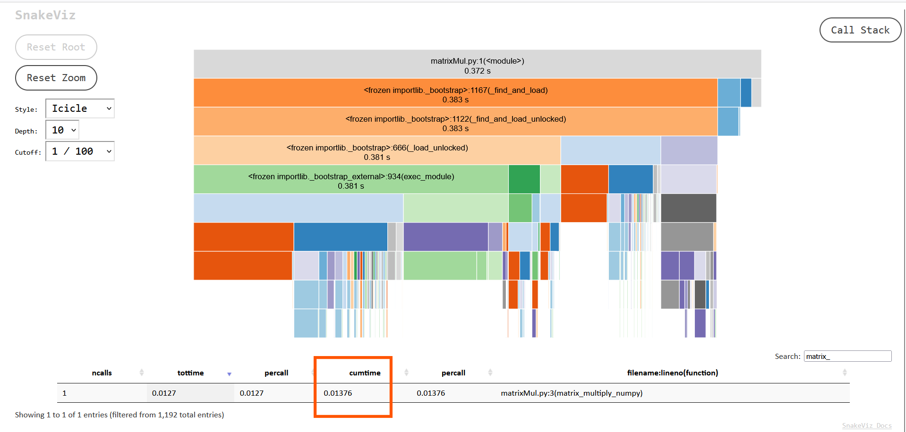
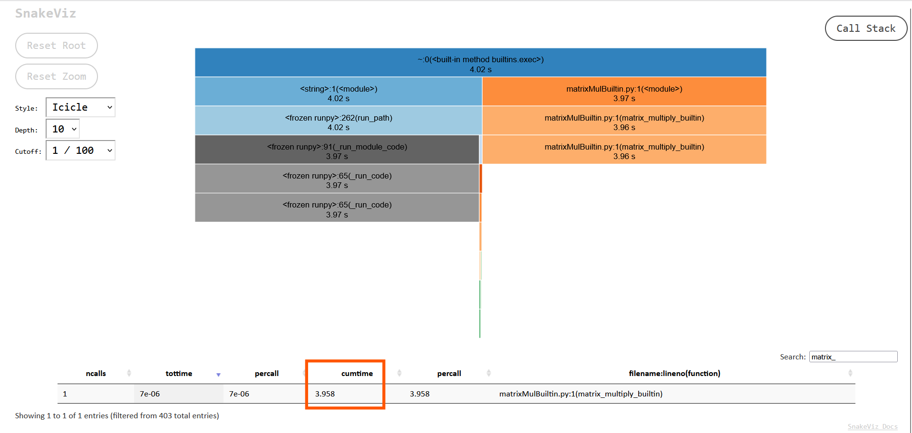

# Python Bytecode Analysis and Profiling

## Overview

This project is designed to analyze Python scripts by generating their bytecode, counting the bytecode instructions, and profiling their execution. The goal is to identify the most commonly used bytecode instructions across a variety of Python scripts and gain insights into their performance characteristics.

The project consists of the following components:
1. **Bytecode Generation**: Converts a Python script into its bytecode and writes the disassembled bytecode to a file.
2. **Instruction Counting**: Counts the frequency of each bytecode instruction and writes the results to a file.
3. **Profiling**: Profiles the execution of the Python script using `cProfile` and generates a `.prof` file for further analysis.

---

## Scripts

### 1. `genByteCode_v2.py`
This script is the core of the project. It performs the following tasks:
- **Generate Bytecode**: Reads a Python script, compiles it into bytecode, and writes the disassembled bytecode to a file.
- **Count Instructions**: Counts the frequency of each bytecode instruction and writes the results to a file.
- **Run Profiler**: Profiles the execution of the Python script using `cProfile` and saves the profiling data to a `.prof` file.

#### Usage
```bash
python3 genByteCode_v2.py <path_to_python3_file>
```

#### Outputs
- `<script_name>_bytecode.txt`: Contains the disassembled bytecode of the script.
- `<script_name>_instr_count.txt`: Contains the frequency of each bytecode instruction.
- `<script_name>.prof`: Contains profiling data for the script.

---

### 2. `matrixMul.py`
This script demonstrates matrix multiplication using the `numpy` library.

#### Usage
Run the script directly:
```bash
python3 matrixMul.py
```

#### Example Input
Matrix 1:
```
[[1, 2, 3],
 [4, 5, 6]]
```

Matrix 2:
```
[[7, 8],
 [9, 10],
 [11, 12]]
```

#### Example Output
Resultant Matrix:
```
[[58, 64],
 [139, 154]]
```

---

### 3. `matrixMulBuiltin.py`
This script demonstrates matrix multiplication using Python's built-in functionality (***without*** `numpy`).

#### Usage
Run the script directly:
```bash
python3 matrixMulBuiltin.py
```

#### Example Input
Matrix 1:
```
[[1, 2, 3],
 [4, 5, 6]]
```

Matrix 2:
```
[[7, 8],
 [9, 10],
 [11, 12]]
```

#### Example Output
Resultant Matrix:
```
[[58, 64],
 [139, 154]]
```

---

### 4. `quickSort.py`
This script implements the QuickSort algorithm, a popular divide-and-conquer sorting algorithm.

#### Usage
Run the script directly:
```bash
python3 quickSort.py
```

#### Example Input
Unsorted List:
```
[10, 7, 8, 9, 1, 5]
```

#### Example Output
Sorted List:
```
[1, 5, 7, 8, 9, 10]
```

#### Code Explanation
1. **Partition Function**:
   - Divides the array into two parts based on a pivot element.
   - Elements smaller than the pivot are moved to the left, and elements greater are moved to the right.

2. **QuickSort Function**:
   - Recursively applies the partitioning process to sort the array.
   - Base case: Stops when the array has one or no elements.

3. **Main Function**:
   - Defines the input array and calls the QuickSort function.
   - Prints the sorted array.

---

### 5. `perceptron2LayerFinal.py`
This script implements a simple two-layer perceptron (neural network) for binary classification.

#### Usage
Run the script directly:
```bash
python3 perceptron2LayerFinal.py
```

#### Example Input
Training Data:
```
X = [[0, 0], [0, 1], [1, 0], [1, 1]]
Y = [0, 1, 1, 0]  # XOR problem
```

#### Example Output
```

XOR Gate -

Found a solution for XOR gate after 1953 attempts!
Hidden layer weights:
 [[-0.8897309   0.29056771]
 [ 0.79319539 -1.26698719]]
Hidden layer biases: [0.46182759 0.4159217 ]
Output layer weights: [0.40120048 1.35341391]
Output layer bias: 0.17142273245500533

Testing the Gate with inputs and printing truth table for: XOR gate:
[0 0] --> 0
[0 1] --> 1
[1 0] --> 1
[1 1] --> 0

XNOR Gate -

Found a solution for XNOR gate after 1751 attempts!
Hidden layer weights:
 [[-1.1037584   1.18553432]
 [-1.46578226  1.02460881]]
Hidden layer biases: [-0.24075301  1.02011689]
Output layer weights: [-1.54767406  1.86394805]
Output layer bias: -0.3437516907441413

Testing the Gate with inputs and printing truth table for: XNOR gate:
[0 0] --> 1
[0 1] --> 0
[1 0] --> 0
[1 1] --> 1
```
#### Code Explanation
1. **Initialization**:
   - Randomly initializes weights for the two layers of the perceptron.
   - Defines the activation function "Step Function"

2. **Forward Propagation**:
   - Computes the output of the first layer using the input and weights.
   - Applies the activation function to the first layer's output.
   - Computes the output of the second layer using the first layer's output and weights.

3. **Backward Propagation**:
   - Calculates the error between the predicted and actual outputs.
   - Updates the weights using gradient descent to minimize the error.

4. **Training Loop**:
   - Iteratively trains the perceptron using the training data.
   - Adjusts weights to improve accuracy over multiple epochs.

5. **Prediction**:
   - Uses the trained weights to predict the output for new inputs.

6. **Main Function**:
   - Defines the training data and initializes the perceptron.
   - Trains the perceptron and prints the final weights.
   - Tests the perceptron on new inputs and prints the predictions.

---
## Workflow

1. **Analyze a Script**:
   - Run the `genByteCode_v2.py` script with the target Python file as an argument.
   - Example:
     ```bash
     python3 genByteCode_v2.py matrixMul.py
     ```
   - Outputs:
     - `matrixMul_bytecode.txt`: Disassembled bytecode.
     - `matrixMul_instr_count.txt`: Bytecode instruction counts.
     - `matrixMul.prof`: Profiling data.

2. **Profile a Script**:
   - View the generated profiling results using `snakeviz`:
     ```bash
     snakeviz matrixMul.prof
     ```

3. **Analyze the results**:
   - Use the `<script_name>_bytecode.txt` file to see the dissassembled ByteCode in human readable format.
   - Use the `<script_name>_instr_count.txt` file to see the frequency of each bytecode instruction (sorted from highest to lowest used).
   - Use the `snakeviz` output (`<script_name>.prof`) for the following purposes:
      - ***Analyze Time Taken by Each Function***: Visualize the time spent in each function during script execution to identify bottlenecks.
      - ***Understand Call Hierarchies***: Explore the call stack and relationships between functions to gain insights into the execution flow.
      - ***Optimize Performance***: Pinpoint functions or sections of code that consume the most time and focus on optimizing them.
      - ***Compare Implementations***: Compare the performance of different implementations (e.g., NumPy vs. built-in) by analyzing their profiling data side by side.
      - ***Validate Improvements***: Use profiling data to confirm the impact of optimizations or code changes on execution time.

---

## Dependencies

- Python 3.x
- `numpy` (for `matrixMul.py`)
- `snakeviz` (for visualizing profiling data)

Install dependencies using `pip`:
```bash
pip install numpy snakeviz
```

## Learnings

For all 4 scripts we have `LOAD_CONST` and `LOAD_NAME` as the ***top most*** used instructions.

### Analysis of Bytecode and Instruction Counts:

###   1. QuickSort (`quickSort_bytecode.txt` and `quickSort_inst_count.txt`)
   - i. **Top Instructions**:
      - `LOAD_CONST`: Frequently used for loading constants like pivot values, indices, and base cases.
      - `LOAD_FAST`: Used to load local variables such as the array, indices, and temporary variables during partitioning.
      - `COMPARE_OP`: Commonly used for comparisons during partitioning to decide element placement relative to the pivot.
      - `CALL_FUNCTION`: Used for recursive calls to the QuickSort function.

   - ii. **Reason for Top Instructions**:
      - QuickSort is a recursive algorithm that heavily relies on comparisons and local variable manipulations. The frequent use of `LOAD_CONST` and `LOAD_FAST` reflects the need to access constants and variables repeatedly. Recursive calls contribute to the high usage of `CALL_FUNCTION`.

###   2. Perceptron (`perceptron2LayerFinal_bytecode.txt` and `perceptron2LayerFinal_inst_count.txt`)
   - i. **Top Instructions**:
      - `LOAD_CONST`: Used for loading constants like weights, biases, and activation thresholds.
      - `LOAD_FAST`: Frequently used for accessing local variables such as inputs, weights, and intermediate results during forward and backward propagation.
      - `BINARY_MULTIPLY` and `BINARY_ADD`: Used for matrix operations and weight updates during training.
      - `COMPARE_OP`: Used for activation function evaluations and error calculations.

   - ii. **Reason for Top Instructions**:
      - The perceptron involves numerous mathematical operations (multiplications, additions) and comparisons for activation functions. The frequent updates to weights and biases during training explain the high usage of `LOAD_FAST` and arithmetic instructions.

###   3. Comparison of matrixMul.py (NumPy) vs matrixMulBuiltin.py

To do a better comparison, lets blow up the `matrix_a` and `matrix_b`:
```bash
matrix_a = [[i + j * 1000 for i in range(200)] for j in range(200)]
matrix_b = [[i + j * 1000 for i in range(200)] for j in range(200)]
```

1. **matrixMul.py (NumPy Implementation)**:
   - The function matrix_multiply_numpy primarily delegates the heavy lifting to the NumPy library by calling `np.dot`.
   - The bytecode shows a direct attribute lookup for the dot method (using LOAD_ATTR dot) on the imported NumPy module, indicating that the computation happens in the optimized C layer.
   - Only a handful of Python-level operations are performed: calling np.dot and then converting the result to a Python list using the tolist method.
   - This results in a very compact bytecode sequence, with most work offloaded to highly efficient, precompiled routine of `np.dot`.
   - After the dot product, the conversion of the NumPy array to a Python list is done via a method call `tolist`, which again is executed at the C level, reducing overhead.
   - If we open the `snakeviz` for this script, we can see the function `matrix_multiply_numpy` took **0.01376 sec** of time.
      

2. **matrixMulBuiltin.py**:
   - The bytecode begins with a check using `len` to ensure that the number of columns in the first matrix matches the number of rows in the second, with a conditional jump that raises a `ValueError` if the condition fails.
   - The matrix multiplication is implemented with nested `list comprehensions` and `generator expressions`.
   - The bytecode for these comprehensions shows multiple iterations `FOR_ITER` and calls to built-in functions like `zip` and `sum`, each adding layers of Python-level execution.
   - Every multiplication and addition is executed at the Python level.
   - This results in significantly more bytecode instructions and, hence, more overhead for each arithmetic operation.
   - The use of generator expressions and list comprehensions involves creating function objects at runtime (indicated by `MAKE_FUNCTION` in the bytecode), which adds further overhead.
   - If we open the `snakeviz` for this script, we can see the function `matrix_multiply_builtin` took **3.958 sec** of time.
      
3. **Overall Conclusion**:
   - The `NumPy` version exhibits a lean and highly optimized bytecode sequence because it leverages precompiled, low-level C functions for the dot product and list conversion.
   - The built-in version, while functionally equivalent, shows a much more complex and verbose bytecode pattern due to explicit Python-level looping, dynamic function creation, and multiple built-in function calls—all of which contribute to lower performance for large matrices.

---

### Virtual Machine
By analyzing the bytecode, it is evident that Python uses the **CPython stack-based Virtual Machine**. 
The bytecode structure, including instructions like `LOAD_CONST`, `LOAD_FAST`, and `CALL_FUNCTION`, are characteristics of CPython's stack-based virtual machine.


---
### Instruction Architecture for Workloads

A hybrid architecture combining stack-based and register-based features would be ideal for handling these workloads efficiently:

1. **Stack-Based Features**:
   - Support for recursive calls and temporary storage, essential for algorithms like QuickSort.
   - Optimized instructions for comparison and branching (`COMPARE_OP`, `POP_JUMP_IF_FALSE`) to enhance performance during partitioning and recursive operations.

2. **Register-Based Features**:
   - Efficient handling of mathematical operations, reducing the overhead of frequent stack manipulations in workloads like Perceptron training.
   - Specialized instructions for matrix operations (e.g., `MATRIX_MULTIPLY`) and activation functions to accelerate neural network computations.

By combining the strengths of both architectures, this hybrid approach can cater to diverse workloads, balancing recursion-heavy and computation-intensive tasks effectively.

